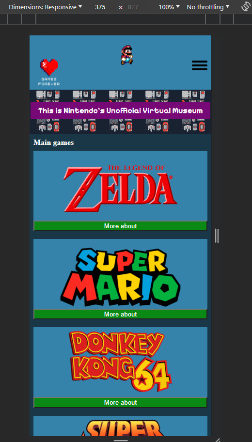
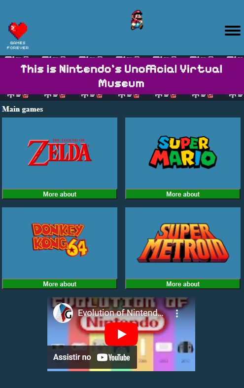
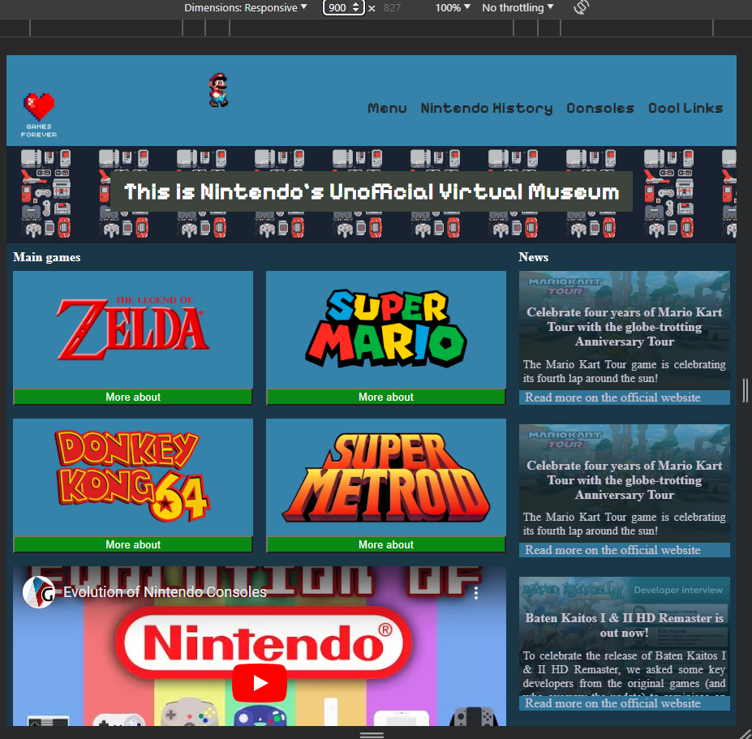
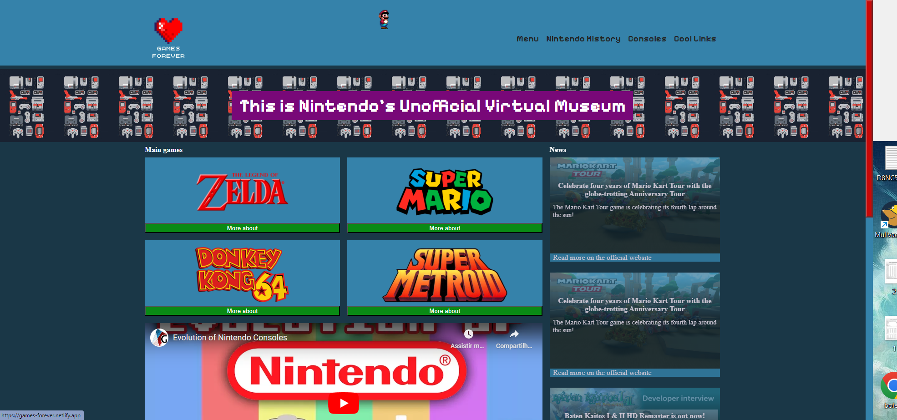
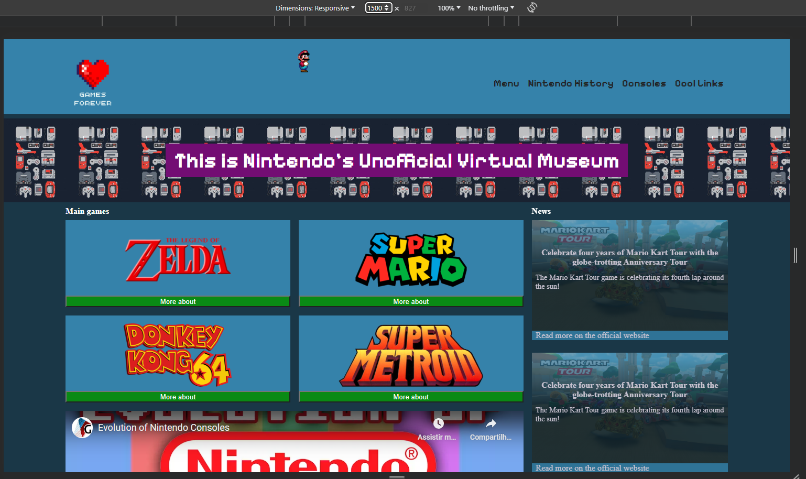
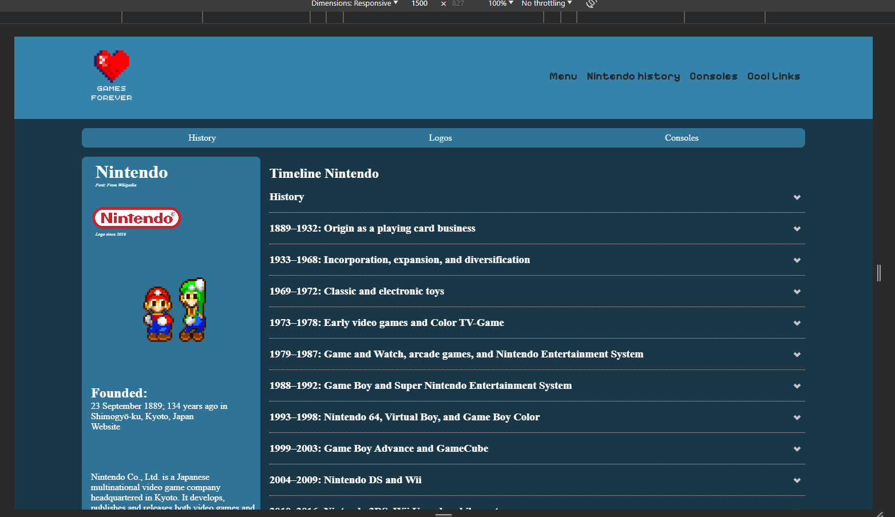
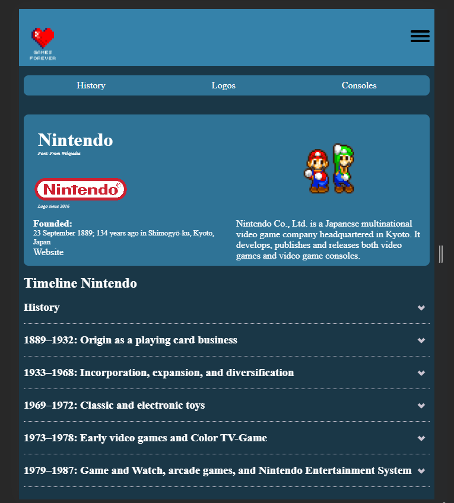

<br/>
<div align="center">
  <h1 text-align="center">Game Forever - This is Nintendo's Unofficial Virtual Museum</h1>
</div>

## About The Project 
<p>
This is the project where I was able to apply the knowledge acquired during the Fundamentals in the FrontEnd Developer course at <a href="https://www.hyperisland.com/">Hyper Island</a>. 
The project brief was to create a 90's website with HTML and CSS, responsive, fluid sizes, and with good development practices. I believe that I can achieve the aspects highlighted in the Brief. Furthermore, I feel that I achieved my personal goals for this project and learned a lot during the construction of it.
</p>

<p> I really like the Nintendo gaming universe 🍄🐢🎮, so my inspiration for this project was about the universe and colors of the Mario Bros world and others Nintendo Games.</p>

## Access my project [Here](https://games-forever.netlify.app/) 🥰. 


<div align="center">

<p>The project has two pages, both responsive✨.</p>








</div>


## Built With

<p align="left"> 
   
  <a href="https://www.w3schools.com/css/" target="_blank" rel="noreferrer"> 
     
  </a> 
  
  <a href="https://www.w3.org/html/" target="_blank" rel="noreferrer"> 
     
  </a> 

</p>


## Getting Started

### Installation

1. Clone the repo

```sh
git clone https://github.com/IngridAkeida/gamesForever.git
```

### Creating A Pull Request

1. Fork the Project
2. Create your Feature Branch (`git checkout -b feature/AmazingFeature`)
3. Commit your Changes (`git commit -m 'Add some AmazingFeature'`)
4. Push to the Branch (`git push origin feature/AmazingFeature`)
5. Open a Pull Request
